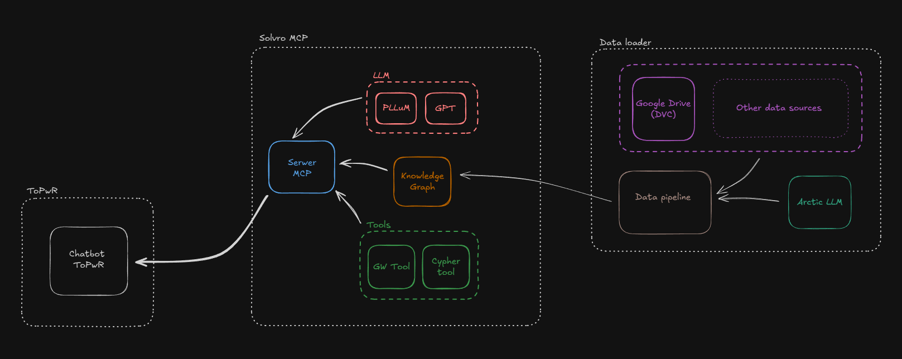
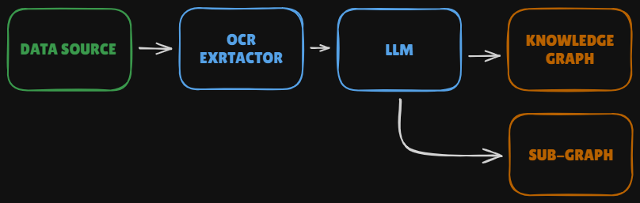

<p align="center">
  
</p>

<h1 align="center">SOLVRO MCP</h1>

<p align="center">
  <strong>Knowledge Graph RAG System for ToPWR</strong><br>
  Intelligent assistant for Wrocław University of Science and Technology
</p>

<p align="center">
  <a href="#quick-start">Quick Start</a> •
  <a href="#architecture">Architecture</a> •
  <a href="#features">Features</a> •
  <a href="#api-usage">API</a>
</p>

---

## ✨ Features

- 🧠 **Intelligent Query Routing** - Guardrails system determines query relevance
- 🔍 **Natural Language to Cypher** - Converts questions to graph queries
- 📊 **Knowledge Graph RAG** - Retrieval-Augmented Generation with Neo4j
- 🔗 **MCP Protocol** - Standard Model Context Protocol interface
- 📈 **Observability** - Optional Langfuse tracing integration
- 🐳 **Docker Ready** - One command deployment

---

## Quick Start

```bash
# Setup
just setup
cp .env.example .env  # Edit with your API keys

# Run with Docker
just up      # Start Neo4j + MCP Server + API
just logs    # View logs
just down    # Stop services
```

---

## Architecture

### System Overview

```
┌─────────────┐     ┌─────────────┐     ┌─────────────┐
│  ToPWR API  │────▶│  MCP Server │────▶│    Neo4j    │
│   :8000     │     │    :8005    │     │    :7687    │
└─────────────┘     └─────────────┘     └─────────────┘
     FastAPI           FastMCP          Knowledge Graph
```

| Service | Port | Description |
|---------|------|-------------|
| `topwr-api` | 8000 | FastAPI backend for ToPWR app |
| `mcp-server` | 8005 | MCP server with RAG pipeline |
| `neo4j` | 7474/7687 | Knowledge graph database |

### RAG Pipeline

The heart of the system is a LangGraph-based RAG pipeline that intelligently processes user queries:

<p align="center">
  
</p>

**Pipeline Flow:**
1. **Guardrails** - Fast LLM determines if query is relevant to knowledge base
2. **Cypher Generation** - Accurate LLM converts natural language to Cypher query
3. **Retrieval** - Execute query against Neo4j knowledge graph
4. **Response** - Return structured context data

### Data Pipeline

Separate ETL pipeline for ingesting documents into the knowledge graph:

<p align="center">
  
</p>

**Pipeline Steps:**
1. **Document Loading** - PDF and text document ingestion
2. **Text Extraction** - OCR and content extraction
3. **LLM Processing** - Generate Cypher queries from content
4. **Graph Population** - Execute queries to build knowledge graph

---

## Configuration

Copy `.env.example` to `.env` and configure:

```env
# Required - at least one LLM key
OPENAI_API_KEY=sk-...
# or
GOOGLE_API_KEY=...

# Required - Neo4j
NEO4J_PASSWORD=your_password

# Optional - Langfuse tracing
LANGFUSE_SECRET_KEY=...
LANGFUSE_PUBLIC_KEY=...
```

---

## Commands

```bash
# Docker Stack
just up          # Start all services
just down        # Stop services
just logs        # View logs
just ps          # Service status
just nuke        # Remove everything

# Local Development
just mcp-server  # Run MCP server
just api         # Run FastAPI
just kg "query"  # Query knowledge graph

# Quality
just lint        # Format & lint
just test        # Run tests
just ci          # Full CI pipeline

# Data Pipeline
just prefect-up  # Start Prefect
just pipeline    # Run ETL
```

---

## Project Structure

```
src/
├── mcp_server/      # MCP server + RAG pipeline
├── mcp_client/      # CLI client  
├── topwr_api/       # FastAPI backend
├── config/          # Configuration
└── data_pipeline/   # Prefect ETL flows

docker/
├── compose.stack.yml    # Main stack (Neo4j + MCP + API)
├── compose.prefect.yml  # Data pipeline
├── Dockerfile.mcp       # MCP server image
└── Dockerfile.api       # FastAPI image
```

---

## API Usage

### Chat Endpoint

```bash
curl -X POST http://localhost:8000/api/chat \
  -H "Content-Type: application/json" \
  -d '{"user_id": "user1", "message": "Czym jest nagroda dziekana?"}'
```

**Response:**
```json
{
  "session_id": "abc123",
  "message": "Nagroda dziekana to wyróżnienie przyznawane...",
  "metadata": {
    "source": "mcp_knowledge_graph",
    "trace_id": "xyz789"
  }
}
```

### Session Management

```bash
# Get session history
curl http://localhost:8000/api/sessions/{session_id}/history

# List user sessions  
curl http://localhost:8000/api/users/{user_id}/sessions
```

---

## Tech Stack

| Technology | Purpose |
|------------|---------|
| **FastMCP** | Model Context Protocol server |
| **LangGraph** | RAG state machine |
| **LangChain** | LLM orchestration |
| **Neo4j** | Knowledge graph database |
| **FastAPI** | REST API backend |
| **Langfuse** | Observability (optional) |
| **Prefect** | Data pipeline orchestration |
| **Docker** | Containerization |

---

## License

MIT © [Solvro](https://solvro.pwr.edu.pl)
