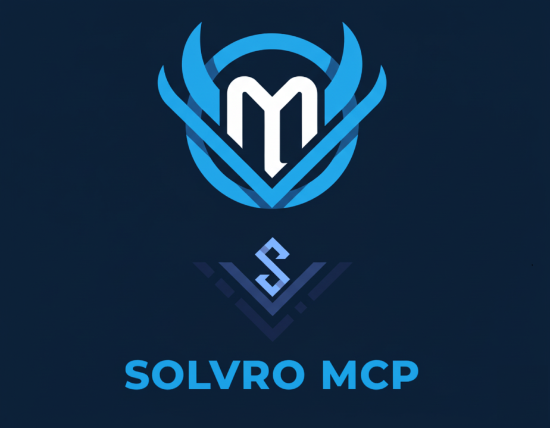
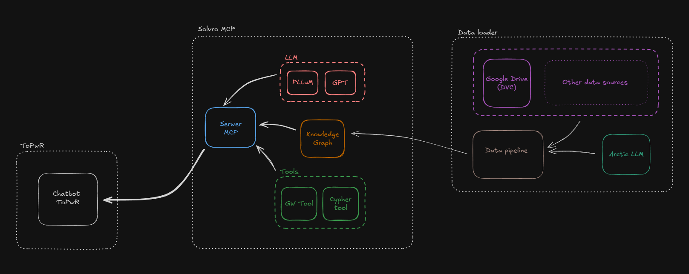
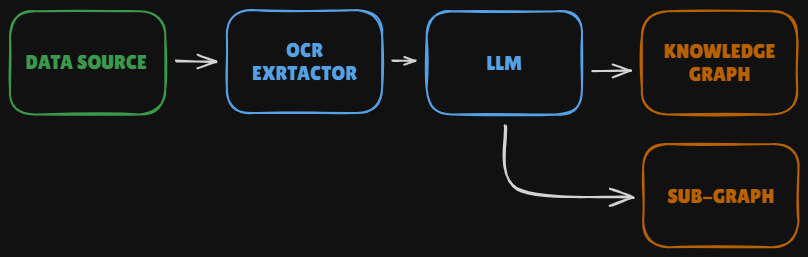

<p align="center">
  
</p>

<h1 align="center">SOLVRO MCPWr</h1>

<p align="center">
  <strong>Knowledge Graph RAG System for PWr</strong><br>
  Intelligent assistant for Wrocław University of Science and Technology
</p>

<p align="center">
  <a href="#quick-start">Quick Start</a> •
  <a href="#architecture">Architecture</a> •
  <a href="#features">Features</a> •
  <a href="#querying-the-server">Querying</a>
</p>

---

```
 backend-mcp (separate repo)   │            ml-mcp (this repo, no host ports)
┌─────────────┐   ┌──────────────┐│   ┌─────────────┐          ┌─────────────┐
│    nginx    │──▶│ chat-service │┼──▶│  MCP Server │─────────▶│    Neo4j    │
│   :8080     │   │              ││   │ :8005 (int.)│          │ :7687 (int.)│
└─────────────┘   └──────────────┘│   └─────────────┘          └─────────────┘
   auth + UI          agent       │ solvro-mcp-internal          mcp_network
```

- **Intelligent Query Routing** - Guardrails system determines query relevance
- **Natural Language to Cypher** - Converts questions to graph queries
- **Knowledge Graph RAG** - Retrieval-Augmented Generation with Neo4j
- **MCP Protocol** - Standard Model Context Protocol interface
- **Observability** - Optional Langfuse tracing integration
- **Docker Ready** - One command deployment

---

## Quick Start

```bash
# Setup
just setup
cp .env.example .env  # Edit with your API keys

# Run with Docker
just up      # Neo4j + MCP Server, reachable only by backend-mcp (no host ports)
just up-dev  # same, plus 127.0.0.1 ports for local work
just logs    # View logs
just down    # Stop services
```

---

## Architecture

### System Overview

```
 backend-mcp (separate repo)   │            ml-mcp (this repo, no host ports)
┌─────────────┐   ┌──────────────┐│   ┌─────────────┐          ┌─────────────┐
│    nginx    │──▶│ chat-service │┼──▶│  MCP Server │─────────▶│    Neo4j    │
│   :8080     │   │              ││   │ :8005 (int.)│          │ :7687 (int.)│
└─────────────┘   └──────────────┘│   └─────────────┘          └─────────────┘
   auth + UI          agent       │ solvro-mcp-internal          mcp_network
```

| Service | Container port | Reachable from | Description |
|---------|----------------|----------------|-------------|
| `mcp-server` | 8005 | `backend-mcp` over `solvro-mcp-internal` | FastMCP server exposing `knowledge_graph_tool` and `/health` |
| `neo4j` | 7474/7687 | `mcp-server` over `mcp_network` only | Knowledge graph database |

The chat UI and the HTTP API that users talk to live in `backend-mcp`; this repository is the
graph, the retrieval pipeline and the ETL that fills it.

Nothing is published on the host. `just up-dev` layers `docker/compose.dev.yml` on top, which
republishes the ports on `127.0.0.1` for the Neo4j browser, `just kg` and `uv run dump-graph`.

### RAG Pipeline

The heart of the system is a LangGraph-based RAG pipeline that intelligently processes user queries:

<p align="center">
  
</p>

**Pipeline Flow:**

1. **Guardrails** - Fast LLM determines if query is relevant to knowledge base
2. **Cypher Generation** - Accurate LLM converts natural language to Cypher query
3. **Retrieval** - Execute query against Neo4j knowledge graph
4. **Response** - Return structured context data

### Data Pipeline

Separate ETL pipeline for ingesting documents into the knowledge graph:

<p align="center">
  
</p>

**Pipeline Steps:**

1. **Document Loading** - PDF and text document ingestion
2. **Text Extraction** - OCR and content extraction
3. **LLM Processing** - Generate Cypher queries from content
4. **Graph Population** - Execute queries to build knowledge graph

---

## Configuration

Copy `.env.example` to `.env` and configure:

```env
########################################
# LLM / AI Provider Keys
########################################

# OpenAI API key (optional)
OPENAI_API_KEY=

# DeepSeek API key (optional)
DEEPSEEK_API_KEY=

# Google Generative AI / PaLM API key (optional)
GOOGLE_API_KEY=

# CLARIN LLM API key (optional, used by API & client)
CLARIN_API_KEY=


########################################
# Logging
########################################

# Root log level for every entry point: DEBUG, INFO, WARNING, ERROR or CRITICAL
LOG_LEVEL=INFO


########################################
# Langfuse Observability
########################################

LANGFUSE_SECRET_KEY=
LANGFUSE_PUBLIC_KEY=
LANGFUSE_HOST=https://cloud.langfuse.com


########################################
# Neo4j Database
########################################

# URI used by data pipeline, MCP server and graph config
NEO4J_URI=bolt://localhost:7687
NEO4J_USER=neo4j
NEO4J_PASSWORD=


########################################
# Data Pipeline Runtime Controls
########################################

# Max parallel pages processed per batch
DATA_PIPELINE_MAX_CONCURRENCY=4

# Minutes after which a stuck in-progress hash can be reclaimed
DATA_PIPELINE_CLAIM_STALE_MINUTES=30


########################################
# MCP Server Networking
########################################

# Bind host for the MCP server process
MCP_BIND_HOST=0.0.0.0

# Host/port used by API and MCP client to reach the MCP server
MCP_HOST=127.0.0.1
MCP_PORT=8005
```

---

## Commands

```bash
# Docker Stack
just up          # Neo4j + MCP server, no host ports
just up-dev      # same, plus 127.0.0.1 ports for local work
just down        # Stop services
just logs        # View logs
just ps          # Service status
just nuke        # Remove everything

# Local Development
just mcp-server  # Run MCP server
just kg "query"  # Query knowledge graph

# Quality
just lint        # Format & lint
just test        # Run tests
just ci          # Full CI pipeline
uv run --with pytest python -m pytest tests/data_pipeline/test_pipeline_concurrency.py -q
                # Run pipeline concurrency/idempotency tests only

# Data Pipeline
just prefect-up  # Start Prefect (UI on 127.0.0.1:4200 only)
just pipeline    # Run ETL
```

---

## Project Structure

```
src/
├── mcp_server/      # MCP server + RAG pipeline
├── mcp_client/      # CLI client
├── config/          # Configuration
└── data_pipeline/   # Prefect ETL flows

docker/
├── compose.stack.yml    # Main stack (Neo4j + MCP server, no host ports)
├── compose.dev.yml      # Override that republishes the ports on 127.0.0.1
├── compose.prefect.yml  # Data pipeline
├── Dockerfile.mcp       # MCP server image
└── Dockerfile.prefect   # Data pipeline image
```

---

## Querying the Server

The server speaks MCP over HTTP at `http://mcp-server:8005/mcp` on the shared network. From the
host, bring the stack up with `just up-dev` and use the CLI:

```bash
just kg "Czym jest nagroda dziekana?"
```

`GET http://127.0.0.1:8005/health` answers `200 {"status": "healthy"}` once the server can reach
Neo4j, and `503` with a `reason` otherwise. The user-facing chat endpoint, sessions and
authentication are in `backend-mcp`.

---

## Tech Stack

| Technology | Purpose |
|------------|---------|
| **FastMCP** | Model Context Protocol server |
| **LangGraph** | RAG state machine |
| **LangChain** | LLM orchestration |
| **Neo4j** | Knowledge graph database |
| **Langfuse** | Observability (optional) |
| **Prefect** | Data pipeline orchestration |
| **Docker** | Containerization |

---

## License

MIT © [Solvro](https://solvro.pwr.edu.pl)
